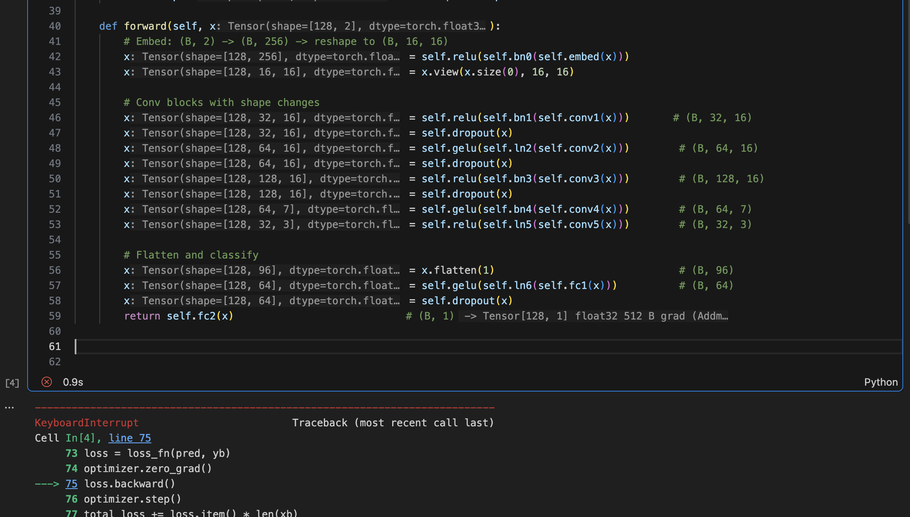

<p align="center">
  <h1 align="center">trickle</h1>
  <p align="center">
    Runtime type annotations for Python — see tensor shapes, variable types, and crash-time values as you code.
  </p>
  <p align="center">
    <a href="https://pypi.org/project/trickle-observe/"></a>
    <a href="https://www.npmjs.com/package/trickle-cli"></a>
    <a href="https://marketplace.visualstudio.com/items?itemName=yiheinchai.trickle-vscode"></a>
    <a href="https://pypi.org/project/trickle-observe/"></a>
    <a href="https://github.com/yiheinchai/trickle/blob/main/LICENSE"></a>
  </p>
</p>

---

No more `print(x.shape)`. Run your code, see every variable's type and value inline — in VSCode or in the terminal.



## Quick Start

```bash
pip install trickle-observe                         # Python runtime tracer
npm install -g trickle-cli                          # CLI (trickle run, trickle hints)
code --install-extension yiheinchai.trickle-vscode  # VSCode inline hints
```

```bash
trickle run python train.py     # run with tracing
trickle hints                   # view source with inline types
```

## See tensor shapes flow through your model

```python
def forward(self, x: Tensor[128, 2] float32):
    x: Tensor[128, 256] float32  = self.relu(self.bn0(self.embed(x)))
    x: Tensor[128, 16, 16] float32  = x.view(x.size(0), 16, 16)
    x: Tensor[128, 32, 16] float32  = self.relu(self.bn1(self.conv1(x)))
    x: Tensor[128, 64, 16] float32  = self.gelu(self.ln2(self.conv2(x)))
    x: Tensor[128, 128, 16] float32  = self.relu(self.bn3(self.conv3(x)))
    x: Tensor[128, 64, 7] float32  = self.gelu(self.bn4(self.conv4(x)))
    x: Tensor[128, 32, 3] float32  = self.relu(self.ln5(self.conv5(x)))
    x: Tensor[128, 96] float32  = x.flatten(1)
    x: Tensor[128, 64] float32  = self.gelu(self.ln6(self.fc1(x)))
    return self.fc2(x)
```

## See exactly what caused a crash

```python
data_dir: PosixPath = Path("../data/gaitpdb/1.0.0")
excluded_files: unknown[] = []
data_file_paths: string[] = [p for p in os.listdir(data_dir) if '.txt' in p]

for file_path: string = "demographics.txt" in data_file_paths:
    with open(data_dir / file_path, 'r') as data:
        patient_gait_data: string[] = data.readlines()
        parsed_data = [[float(d) for d in time.split('\t')] for time in patient_gait_data]
        ~~~~~~~~~~~~~~~~~~~~~~~~~~~~~~~~~~~~~~~~~~~~~~~~~~~~~~~~~~~~~~~~~~~~~~~~~~~~~~
        <- ValueError: could not convert string to float: 'ID'
```

`file_path` is `"demographics.txt"`. `patient_gait_data` is `string[]` — headers, not numbers. Bug found in seconds.

## Commands

### `trickle run`

Run any Python script with automatic variable tracing. Zero code changes needed.

```bash
trickle run python train.py
trickle run python -m pytest tests/
trickle run python manage.py runserver
```

| Flag | Description |
|------|-------------|
| `--include <patterns>` | Only observe matching modules |
| `--exclude <patterns>` | Skip matching modules |
| `--stubs <dir>` | Auto-generate .pyi type stubs after run |
| `-w, --watch` | Watch and re-run on changes |

### `trickle hints`

Output source code with inline type annotations — designed for AI agents and terminal workflows.

```bash
trickle hints train.py                     # types for a file
trickle hints --errors                     # crash-time values + error underline
trickle hints --errors --show types        # types only
trickle hints --errors --show values       # values only
trickle hints --errors --show both         # both (default in error mode)
```

### `trickle vars`

Table view of all captured variables.

```bash
trickle vars                     # all variables
trickle vars --tensors           # only tensors
trickle vars --file model.py     # filter by file
```

### `trickle init`

Set up trickle in a project.

```bash
trickle init
trickle init --python
```

## Jupyter Notebooks

```python
%load_ext trickle                # first cell, then run your code
```

Types appear inline in VSCode immediately after each cell runs.

## Try the demo

```bash
git clone https://github.com/yiheinchai/trickle.git
cd trickle
trickle run python demo/demo.py
trickle hints demo/demo.py
```

## How It Works

Trickle rewrites your Python source via AST transformation before execution. After every variable assignment, it inserts a lightweight call that captures the type and a sample value, then writes to `.trickle/variables.jsonl`.

- Only your code is traced — stdlib, site-packages, torch/numpy internals are skipped
- No code changes. No decorators. No type annotations required
- The [VSCode extension](https://marketplace.visualstudio.com/items?itemName=yiheinchai.trickle-vscode) reads this file and renders inline hints

## Use Cases

- **[ML Engineer](usecases/ml-engineer.md)** — tensor shapes, training loops, Jupyter notebooks
- **[AI Agent](usecases/ai-agent.md)** — runtime context in the terminal for debugging unfamiliar code

## Documentation

- [Features](features.md)
- [Full Docs](docs.md)

## License

Apache-2.0
